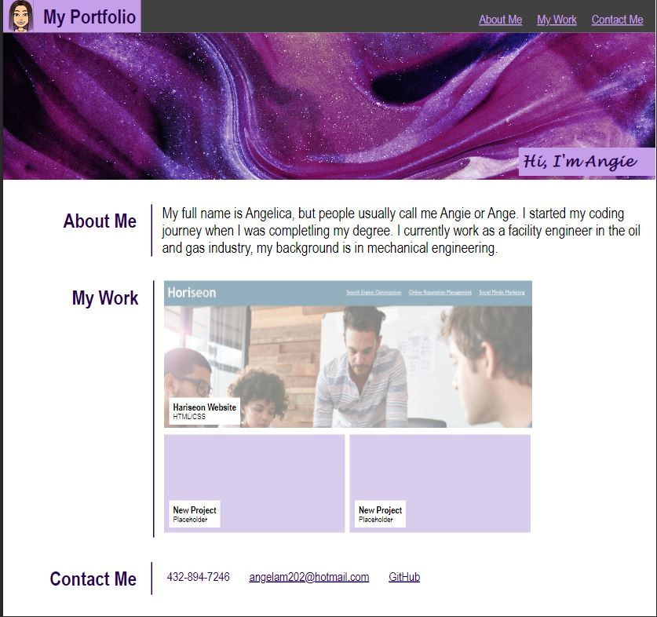

# My Portfolio
Module 2 Challenge

## Description
This portfolio site was created to present to potential employers, so they could review samples of work projects, and asses wheather the potential employee will be a good candidate for an open position.

## Usage
First to open the site, click the followig link.\

Below is a preview of the site.

To navigative the page click on either of the following links and it will take you to that section. These will be located on the top of the page.

In "My Work" section you can navigate to a deployed application by clicking on the preview picture.

Finally all contacts are provided toward the bottom of the page.

## Credit
References:\
Reference Module 1 Challenge provided code.\
https://www.w3schools.com/ \
https://www.semrush.com/blog/semantic-html5-guide/ \
https://www.w3schools.com/css/tryit.asp?filename=trycss_image_text_bottom_right\
https://docs.github.com/en
https://www.w3schools.com/howto/tryit.asp?filename=tryhow_js_mobile_navbar

Pictures:\
https://www.pexels.com/photo/purple-abstract-art-3109807/\
https://wallpapersafari.com/light-purple-backgrounds/

## License
N/A